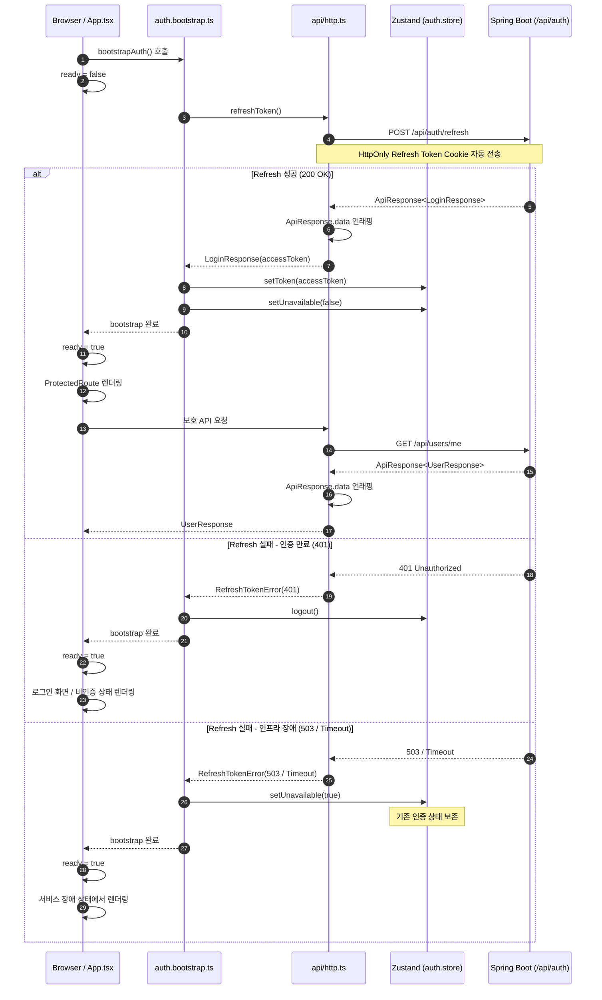

# Phase 2-1: Zustand 기반 JWT Access Token 상태 관리 및 새로고침 증발 방지 최적화

- **Date:** 2026-08-26
- **Status:** COMPLETED
- **Target Component:** `frontend/src/store/auth.store.ts`, `frontend/src/auth/auth.bootstrap.ts`, `frontend/src/api/http.ts`, `frontend/src/App.tsx`
- **Applied Rules:** Zero-Chatter, Documentation First, Modern Web Guidance

---

## 1. 작업 배경 및 목적 (Background & Goals)
1. **Access Token 휘발 방지:** 브라우저 새로고침(F5) 시 Zustand 인메모리 상태가 초기화되어 로그인 세션이 끊기는 현상을 원천 방지.
2. **부트스트랩 인증 게이트웨이:** 앱 초기 구동 시 `HttpOnly` 쿠키에 저장된 Refresh Token으로 세션을 선검증(`bootstrapAuth`)하고, 검증 완료 전까지 라우트 렌더링을 지연시켜 화면 깜빡임(FOUC) 제거.
3. **HTTP 클라이언트 표준화:** 백엔드 표준 공통 응답 포맷인 `ApiResponse<T>`의 `data` 언래핑 처리 및 204 No Content 처리.
4. **동시성 및 장애 내구성(Graceful Degradation):** 동시 다발적 401 발생 시 Single Flight(`refreshPromise`) 처리 및 Redis 장애(503) 시 세션 보존.

---

## 2. 주요 변경 내역 (Key Modifications)

### 1) Zustand Auth Store (`frontend/src/store/auth.store.ts`)
- `persist` 미들웨어를 연동하여 `STORAGE_KEYS.auth`를 통해 로컬 스토리지와 동기화.
- `authServiceUnavailable` 상태 플래그를 추가하여 인증 서버 장애 시 강제 로그아웃 방지.

### 2) Auth Bootstrap (`frontend/src/auth/auth.bootstrap.ts`)
- 앱 마운트 시 `refreshToken()` 1회 실행 후 유효한 토큰 획득 시 Zustand Store에 주입.
- `bootstrapPromise` 싱글톤 캐싱을 통해 다중 호출 방지.
- 401(토큰 만료)에만 `logout()`을 호출하고 503/Timeout에는 `authServiceUnavailable(true)`로 완화 처리.

### 3) HTTP Client (`frontend/src/api/http.ts`)
- `ApiResponse<T>` 제네릭 인터페이스 선언 및 `response.data` 자동 언래핑.
- 204 상태 코드 처리 (`return undefined as T`).
- `refreshToken()` 재시도 타임아웃(5000ms) 및 AbortController 연동.

### 4) App 최상단 게이트웨이 (`frontend/src/App.tsx`)
- `ready` 상태를 두어 `bootstrapAuth()` 완료 시점까지 `<div className="app-loading">` 표출 후 본 라우터 렌더링.

---

## 3. 핵심 아키텍처 흐름도 (Architecture Flow)



---

## 4. 시니어 코드 리뷰 요약 (Senior Review Summary)

| **검토 항목**               | **평가** | **세부 내용**                                                            |
| ----------------------- | :----: | -------------------------------------------------------------------- |
| **새로고침 세션 유지**          | ✅ PASS | `persist` + `bootstrapAuth`를 통해 F5 새로고침 시 Access Token 및 인증 상태 복원    |
| **Race Condition 방지**   | ✅ PASS | `refreshPromise`, `bootstrapPromise` 싱글톤 프로미스를 통해 동시 인증 요청 중복 방지     |
| **장애 내구성 (Resilience)** | ✅ PASS | 503 및 네트워크 단절 시 인증 상태를 즉시 제거하지 않고 서비스 장애 상태로 완화                      |
| **API 응답 포맷 호환성**       | ✅ PASS | 백엔드 `ApiResponse<T>` 표준 응답과 `http.ts`의 `data` 자동 언래핑을 실제 API 호출에서 검증 |
| **실제 인증 흐름**            | ✅ PASS | Login → Refresh → `/me` 및 보호 API 접근까지 Docker 환경에서 정상 동작 확인           |
| **Redis 인증 상태**         | ✅ PASS | Refresh Token Rotation 및 JTI Blacklist 생성·TTL을 Redis에서 직접 확인         |


---

## 5. 실제 실행 및 통합 검증 결과 (Verification)

### 5-1. Docker 기반 실제 환경 검증

* Docker Compose 환경에서 Backend / Frontend / Redis 정상 기동 확인
* 브라우저 F12 Network를 통해 실제 API 요청 및 응답 확인
* 주요 인증 및 RBAC API 정상 응답 확인

| API                      |    결과 | 확인 내용                                      |
| ------------------------ | ----: | ------------------------------------------ |
| `POST /api/auth/login`   | ✅ 200 | Access Token 정상 발급                         |
| `POST /api/auth/refresh` | ✅ 200 | HttpOnly Refresh Token 기반 Access Token 재발급 |
| `GET /api/users/me`      | ✅ 200 | 재발급된 Access Token으로 사용자 정보 조회              |
| `GET /api/menus`         | ✅ 200 | 인증 기반 메뉴 조회                                |
| `GET /api/permissions`   | ✅ 200 | 권한 조회                                      |
| `GET /api/users`         | ✅ 200 | 사용자 조회                                     |
| `GET /api/roles`         | ✅ 200 | Role 조회                                    |

### 5-2. F5 새로고침 인증 흐름

최초 페이지 접근 시 다음 흐름을 확인했다.

```text
Browser
  ↓
POST /api/auth/refresh
  ↓
200 OK
  ↓
Access Token 재발급
  ↓
Zustand Store 복원
  ↓
/api/users/me
  ↓
200 OK
```

또한 최초 접근 과정에서 발생한 `401 /api/auth/refresh`는 **유효하지 않은 Refresh Token 또는 인증 상태에서 발생할 수 있는 정상적인 방어 흐름**이며, 이후 로그인 성공 및 Refresh 성공 상태에서는 정상적으로 `200 OK`가 반환되는 것을 확인했다.

### 5-3. Redis JWT 상태 검증

Redis CLI를 통해 Refresh Token 및 JWT Blacklist 상태를 직접 확인했다.

**Refresh Token 저장 상태**

```text
GET auth:refresh:user:2
"d44cff92-fa1a-4783-b4da-90cf4bef63e8"

TTL auth:refresh:user:2
(integer) 604675
```

Refresh 과정에서 해당 값이 새로운 UUID로 변경되는 것을 확인하여 **Refresh Token Rotation이 실제 Redis에 반영됨을 확인했다.**

```text
GET auth:refresh:user:2
"572bb7b7-3509-4464-a425-13e30c1877d2"
```

### 5-4. JWT Blacklist 및 JTI TTL 검증

Redis에서 다음과 같은 Blacklist Key가 실제 생성되는 것을 확인했다.

```text
SCAN 0 MATCH blacklist:*

1) "blacklist:11925e48-2f13-4a47-bee9-33d2a40d7fde"
2) "blacklist:9773d915-7d03-4282-aa28-a4d711f47aa2"
3) "blacklist:b7fb3b5d-474e-4d07-a726-a995b404fef8"
```

각 JTI 기반 Blacklist Key에 TTL이 설정되어 있으며 시간이 경과하면서 감소하는 것도 확인했다.

```text
TTL blacklist:11925e48-2f13-4a47-bee9-33d2a40d7fde
(integer) 3558

TTL blacklist:9773d915-7d03-4282-aa28-a4d711f47aa2
(integer) 3517

TTL blacklist:b7fb3b5d-474e-4d07-a726-a995b404fef8
(integer) 3430
```

따라서 다음 항목을 실제 Redis 상태까지 검증 완료했다.

* ✅ Refresh Token Redis 저장
* ✅ Refresh Token Rotation
* ✅ JWT `jti` 기반 Blacklist 생성
* ✅ Blacklist TTL 설정
* ✅ TTL 감소 확인

### 5-5. Phase 2-1 최종 검증 상태

**결론: Phase 2-1 기능 및 실제 실행 검증 완료**

```text
Zustand persist
      ↓
F5 새로고침
      ↓
bootstrapAuth()
      ↓
Refresh Token 검증 / Rotation
      ↓
Access Token 재발급
      ↓
Zustand Token 복원
      ↓
/me 인증 확인
      ↓
Protected API 정상 접근
```

또한 Redis에서 Refresh Token 및 JTI Blacklist의 실제 저장 상태와 TTL까지 확인하여 **단순 Unit Test 수준을 넘어 실제 Docker 실행 환경에서 인증 상태를 검증했다.**

---

## 6. 후속 검토 사항

### 6-1. React Query 캐싱 및 API 중복 호출

현재 인증 복원과 API 정상 동작은 확인되었으나, 브라우저 Network에서 `/me` 등의 요청이 여러 번 발생하는 부분은 **Phase 2-2에서 React Query 캐싱 정책과 함께 별도로 분석한다.**

### 6-2. 실시간 화면 갱신

현재 API 호출 자체는 정상적으로 동작하지만, **다른 사용자의 Role / Permission 변경 등이 이미 로드된 화면에 즉시 반영되지 않는 문제**는 별도의 상태 동기화 문제다.

후보:

* React Query `invalidateQueries`
* `refetch`
* polling
* SSE
* WebSocket

따라서 **SSE 도입은 현재 Phase 2-1 완료 조건이 아니며, Phase 2-2의 캐싱/상태 동기화 분석 이후 필요성을 판단한다.**

---

그리고 네가 앞에서 걱정했던 **테스트 2분 23초 문제**와도 구분해서 기록하는 게 좋아.

이번 검증은:

> **코드 레벨 테스트 → 실제 Docker 기동 → 브라우저 API → Redis 상태**

까지 확인한 것이므로 충분히 가치가 있다.

반면 `RolePermissionServiceTest` 같은 테스트를 **계속 무작정 늘리는 것**은 별개의 문제다. 현재 RBAC 핵심 기능과 통합 흐름이 이미 검증된 상태라면, 테스트는 **권한 누락/잘못된 권한 부여/보안 경계처럼 회귀 비용이 큰 핵심 케이스 위주**로 유지하는 편이 낫다.

즉 현재 상태를 한 줄로 정리하면:

**Phase 2-1은 완료 처리하고, 2-2에서 React Query 캐싱 → 중복 API → 화면 상태 동기화 → 필요할 경우 SSE를 판단한다.**
